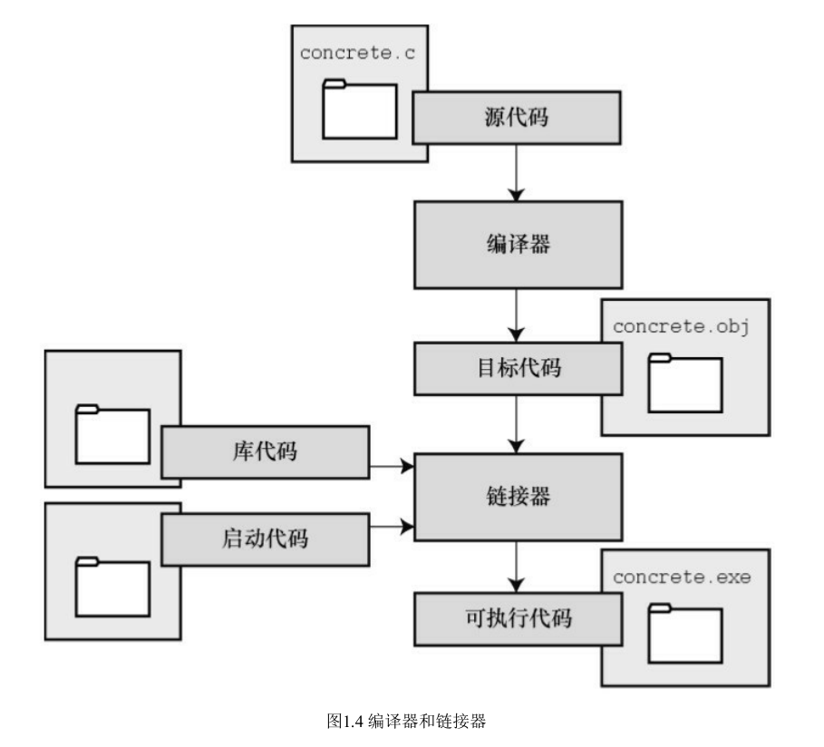

## C 的优点

- 设计特性，融合了计算机科学理论和实践的控制特性。
- 高效性。强大的控制结构，快速，代码紧凑，可移植到其他计算机
- 可移植性。
- 强大而灵活
- 面向程序员

## C 的语言标准

- C89 或 C90：ANSI/ISO C 标准的最终版本
- C99：三个新目标：1、支持国际化编程；2、调整现有实践致力于解决明显的缺陷。3、为适应科学和工程项目中的关键数值计算，提高 C 的适应性。
- C11 标准：

## C 的编程机制

C 编程的基本策略是，用程序把源代码文件转换为可执行文件（其中包含可直接运行的机器语言代码）。典型的 C 实现通过**编译**和**链接**两个步骤来完成这一过程。

编译器把源代码直接转换成机器语言代码，并把结果放在目标代码文件。目标文件代码缺失启动代码。启动代码充当着程序和操作系统之间的接口。还缺失库函数，几乎所有的 C 程序都要使用 C 标准库中的函数。

链接器把中间代码和系统的标准启动代码和库代码合并，生成可执行文件。

中间文件最普遍的一种形式，就是把源代码转换为机器语言代码，并把结果放在目标代码文件（目标文件）中。

