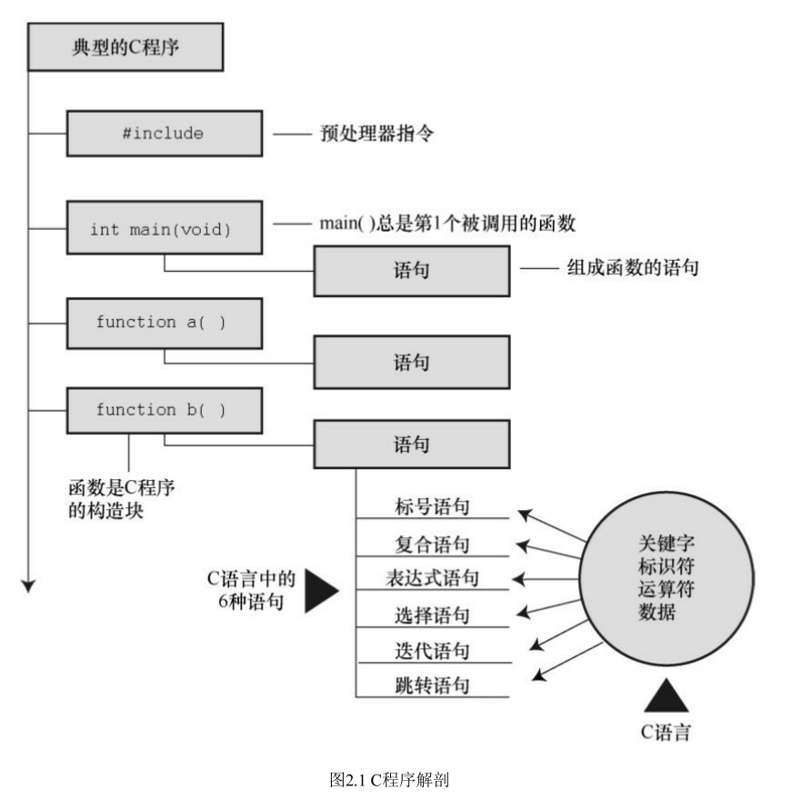

## 简单 C 程序示例及解释

```
#include <stdio.h>
int main(void)
{
  int num;
  num = 1;
  printf("I am a simple");
  printf("computer.\n");
  printf("My favorite number is %d because it is first.\n",num);
  return 0;
}

```



## #include 指令和头文件

`#include <stdio.h>`的作用相当于把`stdio.h`文件中的所有内容都输入该行所在的位置。

`include` 文件提供了一种方便的途径共享许多程序共有的信息。
`#include`这行代码是一条 C 预处理指令(preprocessor directive)。

所有的 C 编译器软件包都提供`stdio.h`文件。该文件包含了供编译器使用的输入和输出函数信息。该文件名的含义是标准输入/输出头文件。
C 程序顶部的信息集合被称为头文件。

头文件包含了编译器创建最终可执行程序要用到的信息。

简而言之，头文件帮助编译器把程序正确地组合到一起。

**为何不置入输入输出？**
因为并非所有的程序都会用到 I/O（输入/输出）包。轻装上阵是 C 语言的哲学。真是这种经济使用资源的规则，使得 C 语言成为流行的嵌入式编程语言。

## main()函数

`int main(void);`

int 是 main()函数的返回类型。void 表示没有传入该函数的信息。

## 声明

在 C 语言中，所有变量都必须先声明才能使用。这意味着必须列出程序中用到的所有变量名及其类型。

声明变量的 4 个理由：

- 1、把所有的变量放在一起，方便读者查找和理解程序的用途。如果变量名就是有意义的最好，否则，在注释中解释变量的含义
- 2、变量声明会促使你在编写程序前做一些计划。
- 3、声明变量有助于发现隐藏在程序中的小错误。
- 4、如果事先未声明变量，C 程序将无法通过编译。

## 关键字和保留标识符

关键字是 C 语言的词汇。

粗体表示的是 C90 标准新增的关键字，斜体表示的 C99 标准新增的
关键字，粗斜体表示的是 C11 标准新增的关键字。


