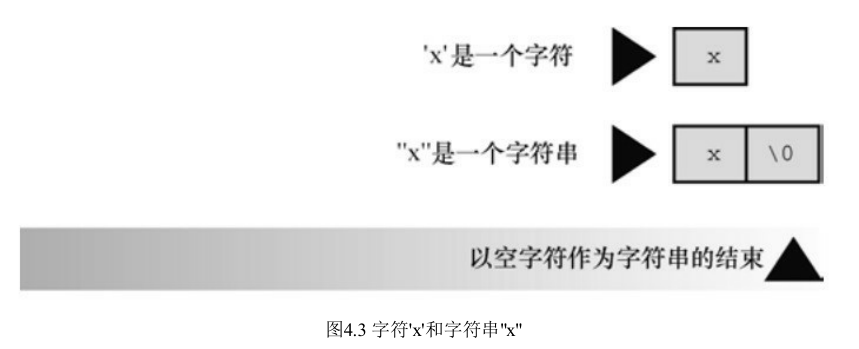

## 前导程序

```
#include <stido.h>
#include <string.h>
#define DENSITY 62.4 //人体密度
int main()
{
  float weight, volume;
  int size, letters;
  char name[40]; // 可容纳40个字符的数组
  printf("Hi! Whats's your first name?\n");
  scanf("%s",name);
  printf("%s, what's your weight in pounds?\n", name);
  scanf("%f",&weight);
  size = sizeof name;
  letters = strlen(name);
  volume = weight / DENSITY;
  printf("Well, %s, your volume is %2.2f cubic feet.\n",name, volume);
  printf("Also, your first name has %d letters,\n",letters);
  printf("and we have %d bytes to store it.\n",size);
  return 0;
}
```

## 字符串简介

字符串（character string）是一个或多个字符的序列，如下所示：
`"Zing went the strings of my heart!"`

### char 类型数组和 null 字符

C 语言没有专门用于存储字符串的变量类型，字符串都被存储在 char 类型的数组中。数组由连续的存储组成，字符串中的字符被储存在相邻的存储单元中，每个单元存储一个字符。

数组末尾的`\0`是空字符（null character），用来标记字符串的结束。空字符不是数字 0，它是非打印字符，其 ASCII 码是 0。

### 字符串和字符

字符串常量`"x"`和字符常量`'x'`不同。区别之一在于`'x'`是基本类型 char，而`"x"`是派生类型 char 数组；区别之二是`"x"`实际上由两个字符组成：`'x'`和空字符`\0`。



### strlen()函数

sizeof 以字节为单位给出对象的大小。strlen()函数给出字符串中的字符长度。

## 常量和 C 预处理器

用大写表示符号常量是 C 语言一贯的传统。
`#define TAXRATE 0.015`编译程序时，程序中所有的 TAXRATE 都会被替换成 0.015。这一过程被称为编译时替换（compile-time substitution）。在运行程序时，程序中所有的替换均已完成。

### printf()和 scanf()的\*修饰符
